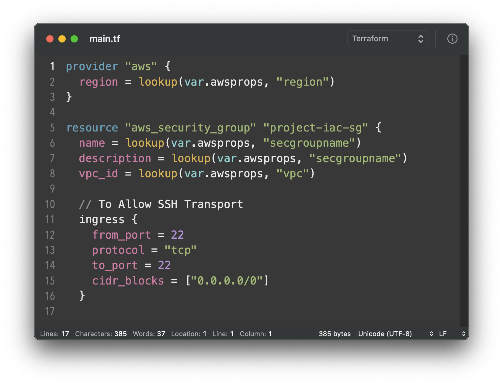

# Hashicorp's Terraform on CoT Editor
Syntax highlighting for Terraform

Feel free to collaborate and improve this project 😊

# Installation

* Clone this repository or simply copy the _Terraform.yml_ file directly.

* Go to _Preferences_ > _Format_ and choose _Import…_ in the gear icon menu that is just below the installed style list.

* Choose the YAML file and _voila!_

# License

The files are distributed under the terms of the MIT license. See the [LICENSE](LICENSE) file for details.
